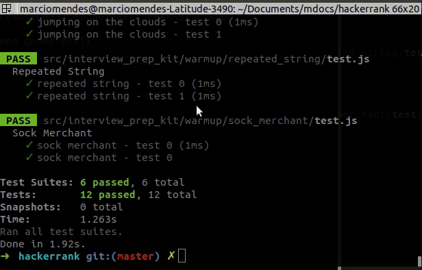

# hackerrank

A list of some algorithms solutions from `hackerrank` using `nodejs`

 

## Running the tests

1. At the terminal:
   - run `yarn test` to run all tests
   - run `jest sum/test.js --watch` to run specific tests

## Built With

- [Jest](https://jestjs.io/) - A delightful JavaScript Testing Framework

## Authors

- **Marcio Mendes** - _Initial work_ - [mmendesas](https://github.com/mmendesas)

## License

This project is licensed under the MIT License - see the [LICENSE.md](LICENSE.md) file for details
